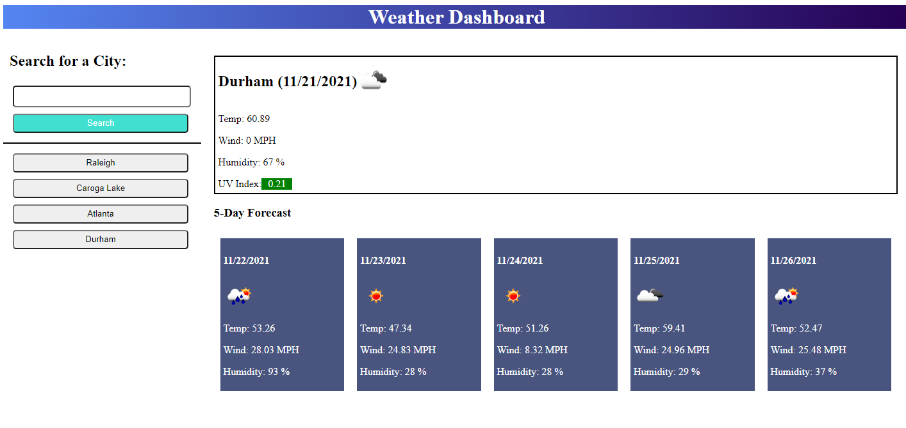

# Weather Dashboard

## About this site

 * When a city is entered into the input field and submitted, the current weather and the forcast for the next 5 days is presented. 

    * The current weather shows the temp, wind speed, humidity and UV index.

    * The UV index shows a color coresponding to the severity

 * A list of previously searched for cities is formed and present the weather for those cities when clicked

 * The searched cities list is saved in local storage to remain between page reloads

## Further work

Though this site is currently functional, there are some features I would like to work on to add

 * When a city is entered into the search input field that is already present on a button, a second button for the same city appears. This should be addressed to only have 1 button per city

 * The site is very plain looking. The CSS could be updated and inovated to be visually more interesting to look at

 * The background of the site could be updated to change to match the current weather conditions of the city that was searched

## Links

* GitHub Repository: [https://github.com/kerbunker/weather-dashboard](https://github.com/kerbunker/weather-dashboard)

* Deployed Site: [https://kerbunker.github.io/weather-dashboard/](https://kerbunker.github.io/weather-dashboard/)

